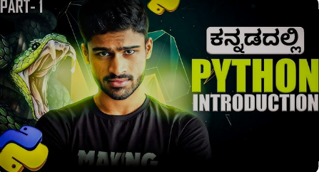

## **Introduction to Python Programming**

### **1. What is Python?**
Python is a high-level, interpreted programming language known for its simplicity and readability. It allows developers to write clear programs for both small and large-scale projects. Python is used for:
- Web development (e.g., Django, Flask)
- Data Science and Machine Learning (e.g., Pandas, TensorFlow)
- Automation (e.g., scripting tasks)
- Software development and more.

### **2. Why is Python Popular?**
- **Easy to learn**: Python’s syntax is simple and very close to natural language, making it a great language for beginners.
- **Community support**: It has a massive community, meaning you'll find lots of tutorials, resources, and libraries.
- **Cross-platform**: Python works on different operating systems (Windows, macOS, Linux, etc.).
- **Versatile**: Whether it's web development, data analysis, or automation, Python has libraries for almost everything.
  
### **3. Setting Up Python Environment**

#### **Step 1: Download Python**
- **Visit**: [Python's official website](https://www.python.org/)
- **Download the latest version** of Python for your operating system (Windows, macOS, or Linux).
- **Installation on Windows**:
  - Check the option **"Add Python to PATH"** during installation.
  - Choose “Install Now” or customize installation options if needed.
  
#### **Step 2: Installing IDE (Integrated Development Environment)**
- **IDE Options**: Python can be written in any text editor, but for ease, it's better to use an IDE. Some popular ones are:
  - **PyCharm**: A full-featured IDE (Download from [here](https://www.jetbrains.com/pycharm/)).
  - **VS Code**: A lightweight editor with Python support (Download from [here](https://code.visualstudio.com/)) - **Recommended**
  - **Jupyter Notebook**: Great for data science and learning Python interactively (Install with `pip install notebook`).
  
#### **Step 3: Verify Installation**
- Open the command prompt or terminal.
- Type `python --version` or `python3 --version` to verify that Python is successfully installed.

### **4. Writing Your First Python Program**
Let’s write a simple program to understand how Python works.

#### **Step 1: Open a Text Editor or IDE**
- Open any text editor like Notepad or an IDE like PyCharm/VS Code.

#### **Step 2: Write Your First Python Code**
```python
print("Hello, World!")
```
This code will print "Hello, World!" on the screen.

#### **Step 3: Run the Program**
- **On IDE**: Click the "Run" button.
- **On Terminal**: Save the file as `hello.py` and navigate to the file location in the terminal. Then run:
```bash
python hello.py
```

### **5. Python as an Interpreted Language**
Unlike other compiled languages like C or Java, Python executes the code line by line, which makes debugging easy. Python doesn't require you to compile your code into machine language; the Python interpreter takes care of it.

#### **Benefits of Interpreted Language:**
- **Easier debugging**: Errors are reported line by line.
- **Faster development**: You can directly run the code without worrying about compiling.

### **6. Key Features of Python**
1. **Simple Syntax**: Easy to read and write, similar to English.
2. **Interpreted**: Python is executed line by line.
3. **Dynamically Typed**: No need to declare variable types explicitly.
4. **Object-Oriented**: Supports OOP (Object-Oriented Programming) like classes and objects.
5. **Rich Standard Library**: Comes with lots of built-in modules and functions.

---

### **Homework**
1. **Download and install Python** on your system. - [Reference Video](https://www.youtube.com/watch?v=Od3ItO2aKAY)
2. **If you don't have a laptop**, Install this app - [Python Code-Pad](https://play.google.com/store/apps/details?id=com.markodevcic.python_code_pad&hl=en_IN)
3. **Write your first Python program** to print your name.
```python
print("Namaste, nanna hesaru [Your Name]!")
```
3. **Practice** running your Python code through both an IDE and a terminal.
4. **Build in Public** Create a post on Linkedin/X and share that you are starting the course and its day 1. (Use #engineeringinkannada and mention me)

### **YouTube Reference**
watch the following YouTube video from my channel:
- [Watch the tutorial on YouTube](https://youtu.be/8c74mXV2lJ0?si=KHrJ3pbPaYkkInQk)





Make sure to subscribe to the channel for more Python tutorial and updates!